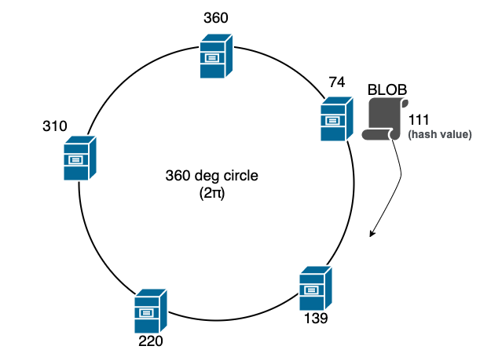
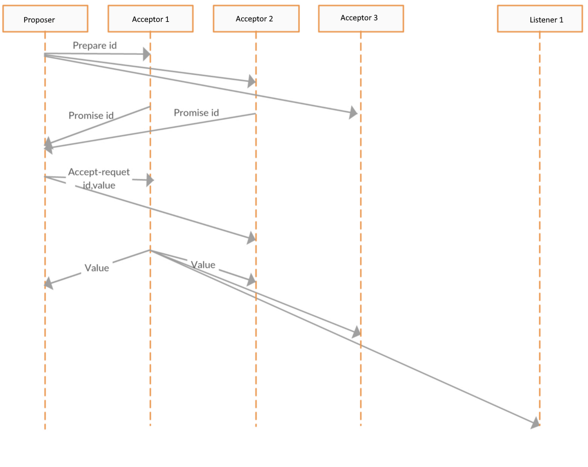
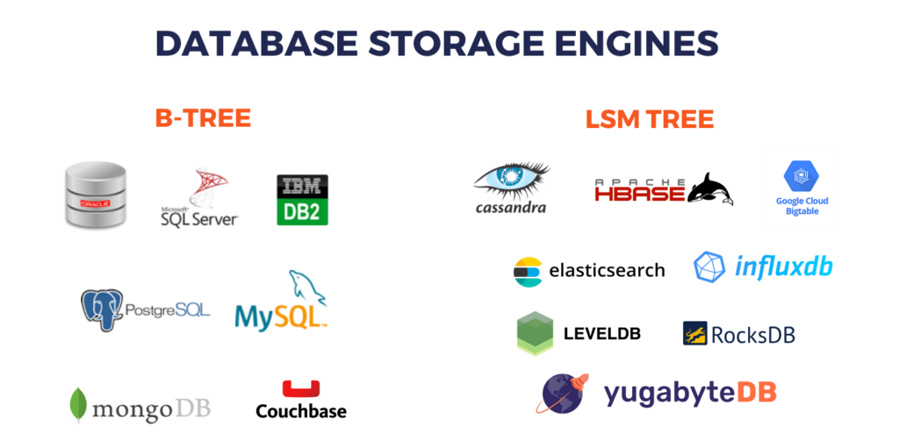
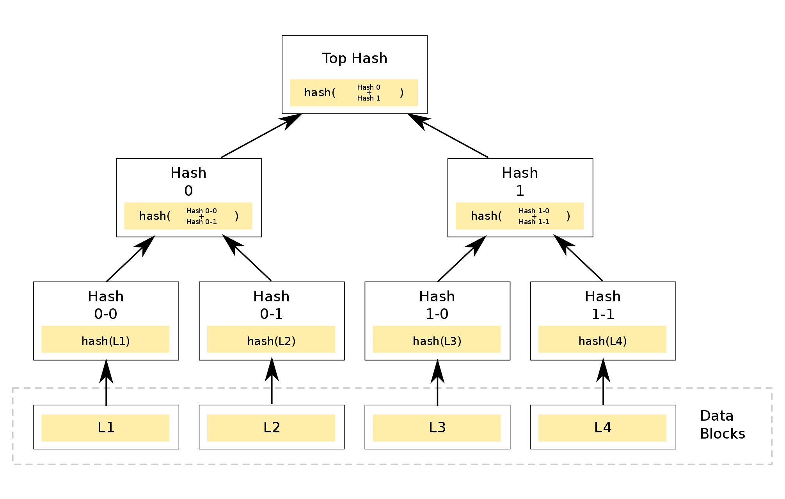
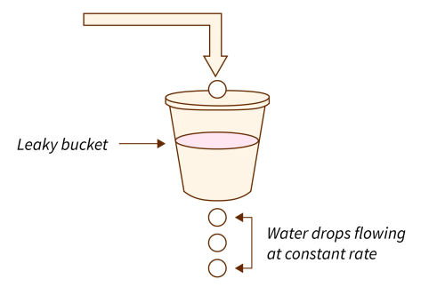

# Consistent Hashing

In a large scale distributed system, we have multiple nodes holding the data.  
And we almost always have nodes being added or removed to scale the demand or maintenance or to improve the performance. This is called horizontal scaling.

In such scenarios we want to distribute the data as evenly as possible.

A common approach to determine which node gets which data is **Simple Hashing**.
For each incoming data, we hash the key (using an algo like Murmur Hash or FNV Hash which give an integer result) and **take a modulo against the number of servers.**

This approach works well when the **number of servers remains constant**. However, when this number gets changed, eg. a server is not available or a new server is added to improve performance, the rebalancing required to move the keys is a huge task.

Here is when consistent hashing comes into picture.

The central idea is, **we use a hash function that randomly maps both the data keys and servers to a unit circle**, usually `2 pi  radians`.   
So, as the diagram below, the 5 servers are placed in a ring (360 degrees) based on the hash of their ID or IP Address   
Each **incoming data key is also then hashed and assigned to the next server that appears on the circle in clockwise order**



This provides an even distribution of data to servers. But, more importantly, if a server fails and is removed from the circle, only the data(keys) that were mapped to the failed server need to be reassigned to the next server in clockwise order. Likewise, if a new server is added, it is added to the unit circle, and only the keys(data) mapped to that server need to be reassigned.

Importantly, when a server is added or removed, the vast majority of the keys(data) maintain their prior server assignments, and the addition of nth server only causes 1/n fraction of the keys(data) to relocate.

Some use cases include DynamoDB, Cassandra, CDN etc.


## Practical extensions
1. In the basic scheme above, if a server fails, all its **BLOBs are reassigned to the next server in clockwise order, potentially doubling the load of that server**.
2. There is a chance that nodes are not uniformly distributed on the consistent hash ring. The nodes that receive a huge amount of traffic become hotspots resulting in cascading failure of the nodes.
3.  **To ensure a more even redistribution of BLOBs on server failure, each server can be hashed to multiple locations on the unit circle.** 
    * When a server fails, the BLOBs assigned to each of its replicas on the unit circle will get reassigned to a different server in clockwise order, thus redistributing the BLOBs more evenly


## Rendezvous hashing
Rendezvous hashing is a simpler and more general technique, and permits fully distributed agreement on a set of 
k options out of a possible set of n options.   
Because of its simplicity and generality, rendezvous hashing is now being used in place of Consistent Hashing in many applications.

**How It Works:**
1. Each item is scored for every server – Instead of picking a server randomly, each item (like a file or user request) gets a unique score for every available server. This score is calculated using a hash function.
2. The highest-scoring server wins – The item is assigned to the server with the highest score.

**Example:**
Imagine you have 3 servers: A, B, and C, and a file called "data123". You compute a score for each server:
* "data123" → Server A: 85
* "data123" → Server B: 72
* "data123" → Server C: 91
* Since Server C has the highest score, "data123" is stored there.

**Benefits:**
* **Even distribution** – Items are spread out fairly among servers.
* **Minimal disruption** – If a server is removed or added, only a few items need to move (unlike traditional hashing, where many might need to be reassigned).
* **Fast lookups** – No need for complex recalculations; just compare scores.

**Key Differences**
| Feature| Rendezvous Hashing| Consistent Hashing | 
|---|---|---|
| Item Assignment| Each item is hashed for every server, and the highest-scoring server gets the item.| Servers and items are both placed on a circular hash ring. Items go to the next available server on the ring. |
| Reassignment on Server Changes| Only items that had the removed/added server as their highest-scoring option are reassigned.| Items assigned to the removed/added server and some neighboring servers get reassigned. |
| Computational Complexity | Must compare hash scores for all servers per item.	| Only a few hash comparisons needed due to the ring structure |
| Load Balancing | Naturally balances well because each item picks the best server based on hashing.| **May require "virtual nodes" to prevent uneven distribution** |
| Fault Tolerance (When a Server Fails)	| Only items assigned to the failed server need reassignment.| Items assigned to the failed server move to the next available server on the ring. |
| Scalability (Adding/Removing Servers) | Very flexible; only affected items move.| Works well, but without virtual nodes, it can cause imbalances.|
| Efficiency for Small Clusters | Simple and works well without extra tweaks.| Can be imbalanced if there aren’t many servers or if virtual nodes aren't used.|


# Geohash


A Geohash is a unique identifier of a specific region on the Earth. The basic idea is that the Earth is divided into regions of user-defined size and each region is assigned a unique id, which is called its Geohash. For a given location on earth, the Geohash algorithm converts its latitude and longitude into a string.

A geohash actually identifies a rectangular cell: at each level, each extra character identifies one of 32 sub-cells.   


The cell sizes of geohashes of different lengths are as follows; note that the cell width reduces moving away from the equator (to 0 at the poles):


| Geohash length |	Cell width x Cell height |
|---|---|
|1	| ≤ 5,000km	×	5,000km |
|2	| ≤ 1,250km	×	625km |
|3	| ≤ 156km	×	156km |
|4	| ≤ 39.1km	×	19.5km |
|5	| ≤ 4.89km	×	4.89km |
|6	| ≤ 1.22km	×	0.61km |
|7	| ≤ 153m	×	153m |
|8	| ≤ 38.2m	×	19.1m |
|9	| ≤ 4.77m	×	4.77m |
|10| 	≤ 1.19m	×	0.596m |
|11| 	≤ 149mm	×	149mm | 
|12| 	≤ 37.2mm × 18.6mm |

Nearby locations generally have similar prefixes, though not always: there are edge-cases straddling large-cell boundaries;   
in France, La Roche-Chalais (u000) is just 30km from Pomerol (ezzz). 

A reliable prefix search for proximate locations will also search prefixes of a cell’s 8 neighbours.   
(e.g. a database query for results within 30-odd kilometres of Pomerol would be  
```
SELECT * FROM MyTable WHERE LEFT(Geohash, 4) IN ('ezzz', 'gbpb, 'u000', 'spbp', 'spbn', 'ezzy', 'ezzw', 'ezzx', 'gbp8'). 
```

Advantages of Geohash
1. Very easy to find the parent cell, by simply truncating the geohash
2. **Very quick calculation to find the adjoining 8 cells**
3. Very quick conversion between GeoHash and Lat,Long and vice-versa 

# Consensus Protocols

When building a distributed system, one principal goal is to build in fault-tolerance. That is, if one particular node in the network goes down, or if there is a network partition, the system should continue to operate in a consistent way, i.e., nodes in the system should have a consensus on the state (or simply “values”) of the system. The consensus should be considered final once it is reached, even if some nodes were in faulty states at the time of decision.

Two well known distributed consensus algorithms are Paxos and Raft. Paxos is used in systems like Chubby by Google, and Raft is used in systems like Kafka etcd.   
Raft is generally seen as more understandable and simpler to implement than Paxos.

##  Byzantine Failure

Consensus algorithms are typically either Byzantine Fault Tolerant, or not. Succinctly, systems which can withstand Byzantine faults are able to withstand misbehaving peers. Most distributed systems such as Kafka, etcd, are not Byzantine Fault Tolerant.  

In order to withstand Byzantine faults, the system must tolerate peers:
* actively spreading incorrect information,
* deliberately not spreading correct information,
* modifying information that would otherwise be correct.

In order to better understand Byzantine Fault Tolerance it helps to imagine the Byzantine Generals Problem:

```
Several Byzantine generals and their armies have surrounded an enemy army inside a deep forest. Separate, they are not strong enough to defeat the enemy, but if they attack in a coordinated fashion they will succeed. They must all agree on a time to attack the enemy.

In order to communicate, the generals can send messengers through the forest. These messages may or may not reach their destination. They could be kidnapped and replaced with imposters, converted to the enemy cause, or outright killed.

How can the generals confidently coordinate a time to attack?
```

## Paxos
Paxos is a consensus protocol. It requires a quorum (more than half) of the nodes to agree on something before it's "true". CAP availability means that if a node isn't down it must respond, but if there's a partition that splits a network of n Paxos nodes then the part(s) of the network that can't talk to n/2 nodes won't be able to have a quorum and thus won't reach consensus so they won't be available for requests that need consensus. In fact, for some kinds of partitions it's possible that no sub-partition will have a quorum.

There are 3 roles in Paxos:

1. Proposers
2. Acceptors
3. Listeners   
Any actor can take on any role at a given point in time.



Proposer proposes an id, it gets accepted by a majority, and then the Proposer proposes a value with that id. Please note that Acceptor 3 has not responded with Promise id. A consensus has been reached for this value and this value is propagated to all the nodes including listener.


## Gossip
Gossip is about letting each node send the latest information it happens to have to some set of other nodes eventually spreading that information throughout the network. Gossip protocols are at best eventually consistent, but aren't even necessarily that. And if there's a partition, nodes in sub-partitions will still happily gossip with each other. So a request that hits one side of a partition can get totally different answers than if it hits another side.

## Raft
Raft can be described as a simpler version of Paxos. It was designed for being more understandable than Paxos. It is a fairly new protocol, being developed in 2014. Raft is used in etcd, consul, docker to name a few. 

Raft decomposes consensus into leader election and log propagation phases. After leader election, leader takes all the decisions and communicates to other nodes through ordered logs.

**Kafka 3.0 has replaced zookeeper based meta-data management with Kafka Raft**

# B-tree vs Log-Structured Merge-tree
The B-tree and the Log-Structured Merge-tree (LSM-tree) are the two most widely used data structures for data-intensive applications to organize and store data. However, each of them has its own advantages and disadvantages. This article aims to use quantitative approaches to compare these two data structures.



## B-tree
 B-tree is a self-balancing tree data structure that maintains sorted data and allows searches, sequential access, insertions, and deletions in logarithmic time. The B-tree generalizes the binary search tree, allowing for nodes with more than two children.
 
There are two kinds of node in a B-tree, internal nodes, and leaf nodes. A leaf node contains data records and has no children, whereas an internal node can have a variable number of child nodes within some pre-defined range. Internal nodes may be joined or split. 


The root node is shown at the top of the tree, and in this case happens to contain a single pivot (20), indicating that records with key k where k ≤ 20 are stored in the first child, and records with key k where k > 20 are stored in the second child. The first child contains two pivot keys (11 and 15), indicating that records with key k where k ≤ 11 is stored in the first child, those with 11 < k ≤ 15 are stored in the second child, and those with k > 15 are stored in the third child. The leftmost leaf node contains three values (3, 5, and 7).

The **B+ tree** is one of the most famous variations of B-tree. The idea behind the B+ tree is that internal nodes only contain keys, and an additional level which contains values is added at the bottom with linked leaves.


## LSM-tree
Log-structured merge-tree is a data structure with performance characteristics that make it attractive for providing indexed access to files with high insert volume, such as transactional log data. LSM trees, like other search trees, maintain key-value pairs. LSM trees maintain data in two or more separate structures, each of which is optimized for its respective underlying storage medium; data is synchronized between the two structures efficiently, in batches.


### Time Complexity

| Algo | B-tree | LSM-tree |
|---|---|---|
| Insert | O(log n) | O (1) |
| Find-min | O(log n) | O(N) |
| Delete | O(log n) | O(N) |


# Merkel Trees

In cryptography and computer science, a hash tree or Merkle tree is a tree in which every "leaf" (node) is labelled with the cryptographic hash of its data block, and every node that is not a leaf ("branch") is labelled with the cryptographic hash of the labels of its child nodes. 

A hash tree allows **efficient and secure verification of the contents of a large data structure**. 




Hash trees can be used to verify any kind of data stored, handled and transferred in and between computers. They can help ensure that data blocks received from other peers in a peer-to-peer network are received undamaged and unaltered, and even to check that the other peers do not lie and send fake blocks.

Hash trees are used in hash-based cryptography, Apache Wave protocol; **Git** and Mercurial distributed revision control systems; and a number of NoSQL systems such as **Apache Cassandra**, Riak, and **Dynamo**.  
Suggestions have been made to use hash trees in trusted computing systems.


# Leaky Bucket Algorithm
The leaky bucket algorithm is a method of congestion control where multiple packets are stored temporarily. These packets are sent to the network at a constant rate that is decided between the sender and the network. This algorithm is used to implement congestion control through traffic shaping in data networks.

To understand the algorithm, let us first discuss the analogy of a leaky bucket.

Consider a bucket with a small hole at the bottom. Now imagine that water is poured into the bucket at random intervals. At each interval, the amount of water poured into the bucket is not fixed. Now it does not matter how much water is inside the bucket, the water comes out at a constant rate from the hole. Consider the image below for more clarity.



Note the following
* The rate at which water leaks (called the leak rate) is independent of the amount of water inside the bucket.
* If the bucket becomes full, the water poured will be lost. 
The same idea of the leaky bucket can be applied to the data packets.


### Implementation
The leaky bucket algorithm can be implemented using a FIFO (First In First Out) queue. Packets that arrive first in the bucket should be transmitted first.

* A queue acts as a bucket or a buffer to hold the packets. This is implemented in the host operating system.
* Packets from the host are pushed into the queue as they arrive.
* At some intervals, the packets are sent to the network depending upon the leak rate. Generally, this interval is a clock tick. A clock tick is an interrupt generated from the physical clock to the processor.
* This leak rate is predetermined by the network. A network will guarantee some dedicated bandwidth for each host. This dedicated bandwidth can be used to set up this leak rate.
* **If this queue is full, then the packets that arrive will be discarded.**